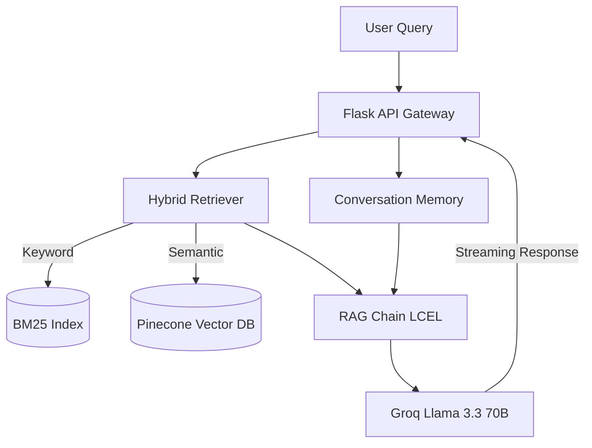

<div align="center">

# 🏥 Clinical RAG Assistant

**An Enterprise-Grade Medical Knowledge Retrieval & Reasoning Engine**

A production-ready **Retrieval-Augmented Generation (RAG)** system designed to answer complex medical questions using verifiable evidence from clinical literature. Features hybrid search, exact source citations, and a responsive, modern chat interface.

[](https://python.org)
[](https://www.docker.com/)
[](https://opensource.org/licenses/MIT)

[Features](#-key-features) •
[Architecture](#-system-architecture) •
[Quick Start](#-quick-start) •
[API Reference](#-api-endpoints)

</div>

---

## 🎯 System Overview

The Clinical RAG Assistant addresses the critical need for verifiable AI in healthcare contexts. By combining state-of-the-art Large Language Models (LLMs) with robust document retrieval mechanisms, it provides accurate, context-aware responses explicitly tied to authoritative medical texts.

<details>
<summary><b>View System Screenshots</b></summary>
<br>

| Chat Interface | Evidence Retrieval |
|:---:|:---:|
|  |  |

*(Replace placeholder paths with actual application screenshots)*
</details>

## 🌟 Key Features

### 🧠 Advanced RAG Engine
* **Hybrid Search Architecture**: Synergizes semantic vector search (Pinecone) with keyword-based retrieval (BM25) via Reciprocal Rank Fusion (RRF) for superior accuracy.
* **Contextual Memory**: Maintains session-aware conversation history for multi-turn reasoning.
* **Granular Citations**: Every generated claim is backed by inline citations linking directly to the source document and specific page.

### 💻 Enterprise UI/UX
* **Modern Interface**: A sleek, dark-themed, glassmorphic design inspired by industry leaders.
* **Interactive Evidence**: Expandable citation panels and clickable PDF links that open directly to the referenced page.
* **Real-time Streaming**: Token-by-token response streaming with dynamic "thinking" indicators.
* **Responsive Design**: Flawless experience across desktop, tablet, and mobile platforms.

### ⚙️ Operational Excellence
* **Automated Ingestion Pipeline**: Drag-and-drop document upload with automatic chunking, embedding, and vector indexing.
* **Containerized Deployment**: Fully Dockerized environment via `docker-compose` for reproducible builds.
* **Evaluation Framework**: Built-in benchmarking tools for measuring semantic and keyword accuracy.

---

## 🏗 System Architecture

The application employs a modular, service-oriented architecture:



## 🛠 Tech Stack

* **Core & Backend**: Python 3.10, Flask
* **AI Orchestration**: LangChain (LCEL)
* **LLM Provider**: Groq (Llama 3.3 70B Versatile)
* **Vector Database**: Pinecone (Serverless)
* **Embeddings**: `sentence-transformers/all-MiniLM-L6-v2`
* **Frontend**: HTML5, Vanilla CSS (Glassmorphism), JavaScript (SSE)
* **Infrastructure**: Docker, Docker Compose

---

## 🚀 Quick Start

### Prerequisites
* Docker and Docker Compose (Recommended)
* OR Python 3.10+
* [Groq API Key](https://console.groq.com/keys)
* [Pinecone API Key](https://app.pinecone.io/)

### Method 1: Docker (Recommended)

1. **Clone the repository**
   ```bash
   git clone https://github.com/your-username/clinical-rag-assistant.git
   cd clinical-rag-assistant
   ```

2. **Configure Environment**
   ```bash
   cp .env.example .env
   # Edit .env with your Groq and Pinecone API keys
   ```

3. **Launch the Stack**
   ```bash
   docker-compose up -d --build
   ```

4. Access the assistant at `http://localhost:5000`

### Method 2: Local Installation

1. **Setup Environment**
   ```bash
   git clone https://github.com/your-username/clinical-rag-assistant.git
   cd clinical-rag-assistant
   python -m venv venv
   source venv/bin/activate  # On Windows: venv\Scripts\activate
   pip install -r requirements.txt
   ```

2. **Configure Environment Variables**
   ```bash
   cp .env.example .env
   # Add your API keys to .env
   ```

3. **Initialize Knowledge Base**
   Add your clinical PDFs to the `data/` directory, then run:
   ```bash
   python ingest.py
   ```

4. **Start the Server**
   ```bash
   python app.py
   ```

---

## 📚 Document Management

The system supports dynamic document ingestion:
1. **Web Interface**: Drag and drop PDFs directly into the sidebar's knowledge base panel.
2. **CLI**: Place PDFs in the `data/` folder and execute `python ingest.py`.

*Uploaded documents are automatically parsed, chunked, embedded, and indexed in the Pinecone vector store.*

---

## 🧪 Evaluation & Testing

Validate the RAG pipeline's accuracy using the built-in evaluation suite:

```bash
python evaluation/evaluate.py
```
This framework tests the system against ground-truth questions, measuring:
* **Keyword Matching**: Percentage of expected critical medical terms present.
* **Semantic Similarity**: Vector cosine similarity between the generated and expected answers.

---

## 📡 API Endpoints

| Endpoint | Method | Description |
|----------|--------|-------------|
| `/` | `GET` | Renders the primary chat interface |
| `/chat` | `POST` | Standard synchronous chat completion |
| `/chat/stream` | `POST` | Server-Sent Events (SSE) streaming chat |
| `/upload` | `POST` | Document ingestion webhook |
| `/api/documents`| `GET` | Retrieves list of indexed document namespaces |

---

## 🤝 Contributing

We welcome contributions to enhance the Clinical RAG Assistant. 

1. Fork the Project
2. Create your Feature Branch (`git checkout -b feature/AmazingFeature`)
3. Commit your Changes (`git commit -m 'Add some AmazingFeature'`)
4. Push to the Branch (`git push origin feature/AmazingFeature`)
5. Open a Pull Request

---

## ⚠️ Disclaimer

> **Medical Advice Disclaimer**: This application is a research and educational tool designed to retrieve information from provided documents. It does not generate medical advice, diagnoses, or treatment plans. Always consult a qualified healthcare professional before making any medical decisions.

## 📄 License

Distributed under the MIT License. See `LICENSE` for more information.

<div align="center">
  <br>
  <i>Engineered with precision for verifiable AI interactions.</i>
</div>
